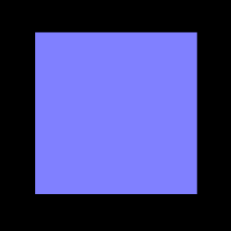

# xnew
Simple javascript library for component based programing.  
Useful for creating apps and games with dynamic scenes.

## Setup
### via cdn  
  
```
<script src="https://unpkg.com/xnew@0.2.x/dist/xnew.js"></script>
```

### via npm
```
npm install xnew
```
```
import { xnew } from 'xnew'
```

## Basic usage
`xnew` create a object called 'node'.

```
const node = xnew(Component, props);

function Component({ node, ...props }) {
    // ...
}
```
```
xnew(({ node }) => {
    // ...
});
```
The features of the node created by xnew is determined by the component function you set. In addition, as shown below, the node has some useful features by default.

## Example
Before describing the specifications, let's look at a example.
Here, we will create a dynamic scene with a rendering library.



#### index.html
```
<html>
<head>
    <meta charset="utf-8">
    <script src="https://unpkg.com/xnew@0.2.x/dist/xnew.js"></script>
    <script src="https://unpkg.com/three@0.142.x/build/three.min.js"></script>
    <script src="script.js"></script>
    <style>
        body { height: 100vh; margin: 0; }
    </style>
</head>
  
<body>
    <script>
        window.addEventListener('DOMContentLoaded', () => {
            xnew(Main);
        });
    </script>
</body>
</html>
```

#### script.js
```
function Main({ node }) {
    // create a screen (xn.Screen defines a canvas in it)
    const screen = xnew(xn.Screen, { width: 800, height: 450 });

    const renderer = new THREE.WebGLRenderer({ canvas: screen.canvas });
    const camera = new THREE.PerspectiveCamera(45, screen.width / screen.height);
    camera.position.set(0, 0, +100);

    const scene = new THREE.Scene();

    // create a cube
    xnew(MyCube, { scene });

    return {
        update: () => {
            renderer.render(scene, camera);
        },
    };
}
```

```
// create a cube and update
function MyCube({ node, scene }) {
    const geometry = new THREE.BoxGeometry(40, 40, 40);
    const material = new THREE.MeshNormalMaterial();
    const object = new THREE.Mesh(geometry, material);
    scene.add(object);

    node.on('click', () => {
        node.isStarted() ? node.stop() : node.start();
    });

    return {
        update: () => {
            object.rotation.y += 0.01;
        },
        finalize: () => {
            scene.remove(object);
        },
    };
}
```

In the above example, we describe code for 3d Cube object as a separate component. Component based description like this, is easy to manage and extend programs because each function can be managed independently.

## Specification

### Overview of `xnew`
```
function xnew (parent, element, Component, props);
function xnew (parent, element, innerHTML);

- return
  - a new node: Node

- parent
  - a node set as parent: Node

- element
  - attributes to create html element: object
    (e.g. { tag: 'div', style: '' })
  - an existing html element or window: HTMLElement or Window
    (e.g. document.querySelector('#hoge'))

- Component: function

- props: object

- innerHTML: string
```


As shown above, xnew accepts some arguments (`parent`, `element`, `Component`, `props`, `innerHTML`). Any of the arguments may be omitted.

- **`parent`**: In many cases, this parameter is omitted, and set automatically. It is set when you intentionally want to bind to another node (described later).
- **`element`**: a parameter for html element to associate with the new node. If you omit this parameter, the new node's element inherits the parent node's element. If there is no parent node, it inherits `document.body` element.
- **`Component`**: this is a function that describe the features of the new node.
- **`props`**: this is a parameter for Component function.
- **`innerHTML`**: this is used when you want to simply set a new html.

### Basic Patterns
#### create a new node
```
xnew(Component, { data: 1 });

function Component({ node, data }) {
    // node: new node object
    // data: 1
    // ...
}
```

#### create a new node and new element (case 1)
```
xnew({ tag: 'div', id: 'hoge' }, Component, { data: 1 });

function Component({ node, data }) {
    // node.element: new element(id=hoge)
    // ...
}
```
- You can also set any attributes.  
 e.g. `{ tag: 'div', type: 'aaa', class: 'bbb', style: 'color: #000;' }`
- If you omit `tag` property, tag=`'div'` will be set automatically.

#### create a new node and a new element (case 2)
```
xnew(Component, { data: 1 });

function Component({ node, data }) {
    node.nestElement({ tag: 'div', id: 'hoge' });

    // node.element: new element(id=hoge)
    // ...
}
```

#### create a new node and a new element (case 3)
```
xnew(Component, { data: 1 });

function Component({ tag: 'div', id: 'hoge' }, { node, data }) {
    node.nestElement({ tag: 'div', id: 'fuga' });

    // node.element: new element(id=fuga)
    // node.element.parentElement: new element(id=hoge)
    // ...
}
```

#### create a new node and associate with an existing element
```
xnew(document.querySelector('#hoge'), Component, { data: 1 });

function Component({ node, data }) {
    // node.element: selected element(id=hoge)
    // ...
}
```

#### create a new node as a child of an existing node
```
const node1 = xnew(Component1);
// ...

const node2 = xnew(node1, Component2);

```
#### create a new node and a new element with innerHTML
```
const node = xnew({ tag: 'div', id: 'hoge' }, `<p>text</p>`);

function Component({ node, data }) {
    // node.element: new element(id=hoge)
    // node.element.innerHTML: <p>text</p>
    // ...
}
```

### Parent-child relationship
If you call `xnew` like nesting, created nodes have a parent-child relationship. Child nodes hold a pointer to parent node. and Child node `element` is set based on the parent node's `element`.

```
<body>
<div id="hoge"></div>

<script>
    const node1 = xnew(document.querySelector('#hoge'), ({ node }) => {
        // node.parent: null
        // node.element: hoge

        const node2 = xnew(({ node }) => {
            // node.parent: node1
            // node.element: hoge (equal to parent's element)
        });

        const node3 = xnew({ tag: 'div', id: 'fuga' }, ({ node }) => {
            // node.parent: node1
            // node.element: fuga (as a child element of hoge)
        });

        const node4 = xnew(({ node }) => {
            // create new element and replace node.element
            node.nestElement({ tag: 'div', id: 'piyo' };

            // node.parent: node1
            // node.element: piyo (as a child element of hoge)
        });
    });
</script>
</body>
```

### System functions 
nodes has some system functions for basic control. You can define the detail in the response of the component function.

```
const node = xnew(({ node }) => {

    return {
        promise: new Promise((resolve, reject) => {
            // update will not start until this promise is resolved.
        }), 
        start: () => {
            // fires before first update.
        },
        update: () => {
            // executed repeatedly
        },
        stop: () => {
            // fires before animation stops.
        },
        finalize: () => {
            // fires when node.finalize() is called
            // note that it is also called automatically when parent node finalizes.
        },
    }
});

node.start();    // start animation
node.stop();     // stop animation
node.finalize(); // current node and the child nodes will be deleted 

node.isStarted();   // return boolean 
node.isStopped();   // ...
node.isFinalized(); // ...
```

- By default, nodes automatically calls start when there are created. If you want to avoid it, call `node.stop()` inside the component function.


### Original functions
You can define original functions unless the function is already defined.
```
const node = xnew(({ node }) =>  {
    let counter = 0;

    return {
        countUp: () => {
            counter++;
        },
        // setter getter
        counter: {
            set: (value) => counter = value, 
            get: () => counter,
        },
    }
});

node.countUp(); // 0 -> 1
node.counter = 2;       // setter
const x = node.counter; // getter

```
- Avoid using name starting with an underscore `_`, because it is used as internal function of nodes.

### Event listener
You can set the event listener using `on`, and fire original event using `emit`.
```
const node = xnew(({ node }) => {
    node.on('click', (event) => {
        // fires when the element is clicked.
    });

    // original event
    node.on('myevent', (data) => {
        // fires when emit('myevent') is called.
    });

    // node.off(); // unset all listeners in the node
    // node.off('myevent'); // unset 'myevent'
});

node.emit('myevent', data); 
```
- `emit('myevent')` emits only to self node, and not to other nodes.
- If you add `#` token (ex. `emit('#myevent')`), it emit to all nodes. this message can be received by using `on('#myevent')`.

### Timer
By using a timer, you can set a function to be executed after a specified time.
```
xnew(({ node }) =>  {
    // call only once (1000ms delay)
    const id1 = node.setTimer(1000, () => {
        // ...
    });

    // call repeatedly (1000ms interval)
    const id2 = node.setTimer(1000, () => {
        // ...
    }, true);
});

```
- Timers can be canceled by calling `node.clearTimer(id)` using the id.
- Timers are automatically canceled when `node.finalize()` is called.

### Find node
If you set a key for a node, you can find the node.

```
const node1 = xnew(({ node }) => {
    node.key = 'aaa';
});
const node2 = xnew(({ node }) => {
    node.key = 'bbb';
});
const node3 = xnew(({ node }) => {
    node.key = 'bbb ccc';
});


xfind('aaa'); // [node1]
xfind('bbb'); // [node2, node3]
xfind('ccc'); // [node3]
xfind('aaa bbb'); // [node1, node2, node3]

```
### Parent node
If you want to intentionally change the parent node, set first argument of `xnew`. For example, it is set in cases such as scene changes, where you want to create a sibling node in a node.

```
const root = xnew(({ node }) =>  {
    xnew(Scene1);
});

function Scene1 ({ node }) {
    return {
        nextScene: () => {
            xnew(node.parent, Scene2); // node.parent == root
            node.finalize();
        },
    }

    // case1 : xnew(Scene2) or xnew(node, Scene2)
    //         root -> 'Scene1' -> 'Scene2'
    // 
    // case2 : xnew(node.parent, Scene2)
    //         root -> 'Scene1'
    //              -> 'Scene2'
}

function Scene2 ({ node }) {
    // ...
}

```
- If you don't set the parent node, Scene2 node will also be deleted when `node.finalize()` is called because Scene2 node is a child of Scene1 node.

### Shared data
You can use `node.shared` when you want to share data among nodes connected by parent-child relationship.


```
xnew(({ node }) =>  {
    node.shared.hoge = 1;

    xnew(({ node }) =>  {
        node.shared.hoge; // 1
    });
});
```
